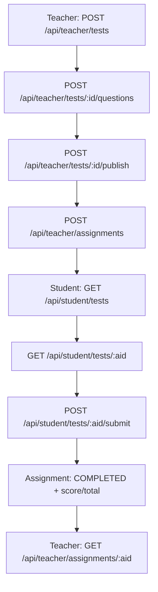

# Бэкенд: обзор (papaLMS)

Этот документ описывает серверную часть проекта, маршруты API, модель данных и основные потоки.

---

## Стек и среда

- Next.js 16 App Router API (`src/app/api/**/route.ts`)
- Prisma ORM + PostgreSQL
- Авторизация по httpOnly cookie `token`
- Опциональные внешние сервисы: Ollama (генерация текста), Pexels (картинки)

Серверная логика находится внутри Next.js; отдельного API‑сервера нет.

---

## Авторизация и сессия

- При логине выставляется httpOnly cookie `token` со значением `user.id`.
- `currentUser()` в `src/lib/auth.ts` читает cookie и грузит пользователя из БД.
- Каждая ручка сама проверяет роль и доступ.

Ключевые файлы:
- `src/lib/auth.ts`
- `src/app/api/auth/*`

Эндпоинты:
- `POST /api/auth/login`
- `POST /api/auth/register`
- `GET /api/auth/me`
- `POST /api/auth/logout`

---

## Слой работы с БД

- Основной слой: `src/lib/mockdb.ts` (историческое имя).
- Prisma‑клиент используется внутри него.
- Функции изолируют запросы: курсы, записи, тесты, назначения и т.д.

---

## Основная модель данных (Prisma)

Смотри `prisma/schema.prisma`.

- `User` (STUDENT / TEACHER / ADMIN)
- `Profile`
- `Course` + `Enrollment`
- `Material`
- `WeeklyScore`
- `TeacherInvite`
- `Test`, `Question`, `TestAssignment`, `GuestTestAttempt`
- `Presentation`

---

## Группы API

### Курсы (публичные + студенты)

- `GET /api/courses` — список, поддерживает `q` и `mine=1`
- `GET /api/courses/:id` — детали курса
- `POST /api/courses/:id/enroll` — запись/отписка (только студент)
- `GET/POST /api/courses/:id/materials` — материалы (добавлять может только преподаватель курса)

### Студенты

- `GET /api/student/tests`
- `GET /api/student/tests/:aid`
- `POST /api/student/tests/:aid/submit`
- `GET /api/student/weekly-scores`

### Преподаватели

- `GET/POST /api/teacher/courses`
- `GET /api/teacher/courses/:cid/students`
- `GET/POST /api/teacher/tests`
- `GET/POST /api/teacher/tests/:id/questions`
- `PUT/DELETE /api/teacher/tests/:id/questions/:qid`
- `POST /api/teacher/tests/:id/publish`
- `GET/POST /api/teacher/tests/:id/assignments`
- `GET/POST /api/teacher/assignments`
- `GET/PUT /api/teacher/assignments/:aid`
- `POST /api/teacher/assignments/:aid/feedback`
- `GET/POST /api/teacher/weekly-scores`
- `GET /api/teacher/analytics`
- `GET /api/teacher/analytics/student`
- Презентации: `GET/POST /api/teacher/presentations`, `DELETE /api/teacher/presentations/:id`,
  `POST /api/teacher/presentations/generate`, `POST /api/teacher/presentations/expand`

### Админ

- `GET/POST /api/admin/teacher-invites`
- `GET /api/admin/teachers`
- `GET /api/admin/students`

Примечание: для приглашения преподавателя админ задаёт ИИН. В ответе возвращается `code`, из него формируется ссылка вида `/teacher/invite/{code}`. При регистрации проверяется совпадение ИИН.

### Публичные тесты

- `GET /api/tests/:code`
- `POST /api/tests/:code/submit`

### Служебные/черновые

- `/api/attendance`, `/api/grades`, `/api/assignments`, `/api/submissions`, `/api/announcements`, `/api/sessions`

---

## Как работают тесты

### Типы вопросов

- С одним правильным: `options` + `correctIndex`
- С несколькими правильными: `options` + `correctIndices`
- True/False: фактически обычный single‑choice с опциями `"Верно" / "Неверно"`
- Длинный ответ: без `options`, возможен `answerText` как эталон

### Создание и редактирование (TEACHER)

1) Создать тест: `POST /api/teacher/tests`
2) Добавить/редактировать вопросы: `POST|PATCH|DELETE /api/teacher/tests/:id/questions`
3) Опубликовать (для публичной ссылки): `POST /api/teacher/tests/:id/publish`

Важно: после публикации вопросы блокируются — сервер возвращает `PUBLISHED` (409) при попытке правок.

### Назначение студентам

- Назначение: `POST /api/teacher/assignments` (передаются `testId`, `studentId`, `dueAt`)
- Список назначений по тесту: `GET /api/teacher/tests/:id/assignments`
- Статусы студентов: `GET /api/teacher/tests/:id/status`

Статусы по умолчанию: `ASSIGNED`. На сервере статус меняется на `COMPLETED` при сдаче. `IN_PROGRESS` сейчас не устанавливается сервером.

### Прохождение студентом

- Список назначенных тестов: `GET /api/student/tests`
- Детали назначения и вопросы: `GET /api/student/tests/:aid`
- Отправка ответов: `POST /api/student/tests/:aid/submit`

При отправке:
- Ответы сохраняются как `answers`.
- Автооценка считается только по вопросам с вариантами ответов.
- Для multi‑select ответ должен полностью совпадать с набором правильных индексов (без частичного балла).
- Для вопросов без вариантов ответ сохраняется, но в `score/total` не учитывается.
- Назначение помечается как `COMPLETED` и сохраняет `score`, `total`, `completedAt`.

### Проверка и фидбэк (TEACHER)

- Просмотр попытки: `GET /api/teacher/assignments/:aid`
- Фидбэк вручную: `PUT /api/teacher/assignments/:aid/feedback`
- Фидбэк через Ollama: `POST /api/teacher/assignments/:aid/feedback`

Фидбэк хранится в `feedback`, а время проверки — в `reviewedAt`.

### Публичные тесты (гости)

- Получить опубликованный тест: `GET /api/tests/:code`
- Отправить ответы: `POST /api/tests/:code/submit`

Ограничения:
- Требуется имя (иначе `NAME_REQUIRED`).
- Счёт считается только по вопросам с вариантами ответов.
- Попытка сохраняется в `GuestTestAttempt`.

### ИИ‑генератор тестов (Ollama)

Эндпоинт: `POST /api/teacher/tests/generate`

Поведение:
- Генерирует вопросы типов `multiple`, `multi`, `truefalse`, `long`.
- Если `draft=true`, возвращает черновик без сохранения в БД.
- Иначе создаёт тест и добавляет вопросы автоматически.

---

## Оценки и рейтинг (БД)

### Таблица WeeklyScore

Оценки хранятся помесячно/понедельно на уровне строки:

- Уникальность: `(courseId, studentId, week)` — один набор оценок на студента и неделю.
- Основные поля: `lectureScore`, `practiceScore`, `individualWorkScore` (целые 0–100).
- Дополнительные поля: `ratingScore`, `midtermScore`, `examScore` (nullable).
- `part` — часть семестра (1 или 2). По умолчанию: `week <= 7` → часть 1, иначе часть 2.

### Как преподаватель выставляет оценки

Эндпоинт: `POST /api/teacher/weekly-scores`

Проверки на сервере:
- роль преподавателя;
- курс принадлежит этому преподавателю;
- студент существует и записан на курс;
- неделя в диапазоне 1–14.

Запись в БД:
- используется `upsert` по ключу `(courseId, studentId, week)`;
- значения округляются и ограничиваются диапазоном 0–100;
- обязательные поля при отсутствии превращаются в `0`, опциональные — в `null`.

### Как студент видит оценки

Эндпоинт: `GET /api/student/weekly-scores`

Возвращается список строк `WeeklyScore` с привязкой к курсу и неделе. Клиентская таблица фильтрует по курсу/неделе/части, а суммарный рейтинг не рассчитывается сервером.

### Структура рейтинга

В модели нет отдельной сущности «рейтинг». Он представлен набором полей в `WeeklyScore`:
- `ratingScore` — текущий рейтинг за неделю (если используется);
- `midtermScore` — контроль/мидтерм;
- `examScore` — итоговый экзамен.

Итоговые значения (семестр/курс) не агрегируются на сервере автоматически — при необходимости считаются на клиенте или добавляются отдельным API.

---

## Типовые ответы и ошибки

- Обычно: `{ items: [] }`, `{ item: {} }` или `{ error: "CODE" }`.
- 401 — не авторизован, 403 — нет роли/доступа.
- В логах Prisma для уникальности — `P2002`.

---

## Миграции и сиды

- `npm run db:setup` = `prisma migrate deploy` + `npm run seed`.
- Сиды: `prisma/seed.cjs` (демо‑пользователи, курсы и т.д.).
- При изменении схемы: `npx prisma migrate dev --name ...` и коммит миграции.

---

## Интеграция Ollama (презентации)

Эндпоинты:
- `POST /api/teacher/presentations/generate`
- `POST /api/teacher/presentations/expand`

Поток:
1) Сервер читает промпты из `prompts/`.
2) Шлёт запрос в Ollama `/api/generate`.
3) Нормализует ответ в структуру слайдов.
4) Опционально подтягивает картинки из Pexels.

Переменные окружения:
- `OLLAMA_BASE_URL`
- `OLLAMA_MODEL`
- `OLLAMA_TIMEOUT_MS` или `OLLAMA_TIMEOUT`
- `PEXELS_API_KEY`
- `PRESENTATION_PROMPT_PATH`
- `PRESENTATION_DETAIL_PROMPT_PATH`
- `PRESENTATION_DETAIL_RULES_PATH`

---

## Где искать серверный код

- API‑роуты: `src/app/api/**/route.ts`
- Доступ к БД: `src/lib/mockdb.ts`
- Авторизация: `src/lib/auth.ts`
- Prisma‑схема: `prisma/schema.prisma`
- Сиды: `prisma/seed.cjs`

---

## Диаграммы

### Авторизация и доступ

```mermaid
graph TD
  A[Клиент: логин] --> B[POST /api/auth/login]
  B --> C[setAuthCookie(token = user.id)]
  C --> D[Клиент: запрос к API]
  D --> E[currentUser() читает cookie]
  E --> F{Пользователь найден?}
  F -- нет --> G[401 Unauthorized]
  F -- да --> H{Роль подходит?}
  H -- нет --> I[403 Forbidden]
  H -- да --> J[Обработка запроса]
```

### Запись студента на курс

```mermaid
graph TD
  A[Клиент: нажал Записаться] --> B[POST /api/courses/:id/enroll]
  B --> C[currentUser()]
  C --> D{Роль STUDENT?}
  D -- нет --> E[403 Forbidden]
  D -- да --> F[toggleEnroll()]
  F --> G[Создать/удалить Enrollment]
  G --> H[Ответ: item с isEnrolled]
```

### Публикация теста и гостевые попытки

```mermaid
graph TD
  A[Teacher: publish] --> B[POST /api/teacher/tests/:id/publish]
  B --> C[publicCode + publishedAt]
  C --> D[Ссылка /tests/{code}]
  D --> E[Guest: GET /api/tests/:code]
  E --> F[Guest: POST /api/tests/:code/submit]
  F --> G[Сохранить GuestTestAttempt]
```

### Поток теста (назначение → сдача → проверка)


