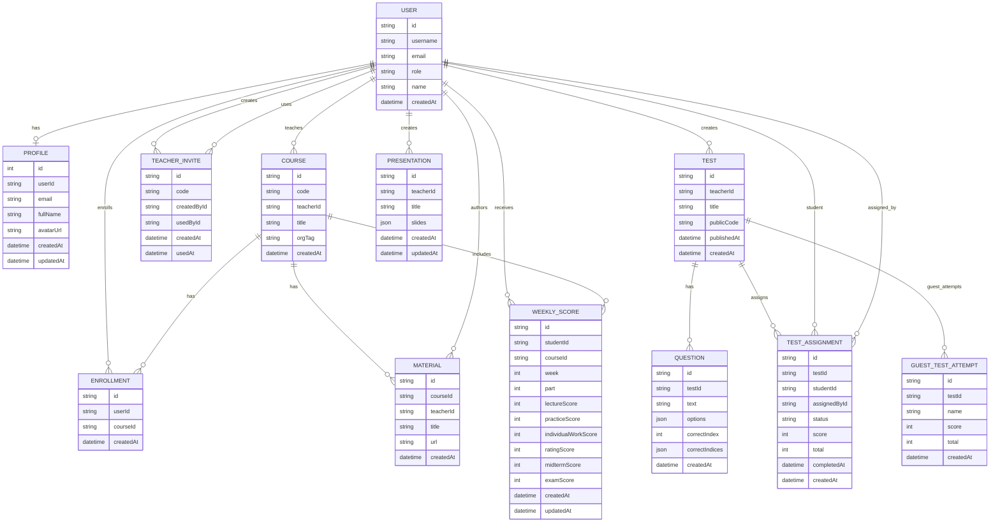
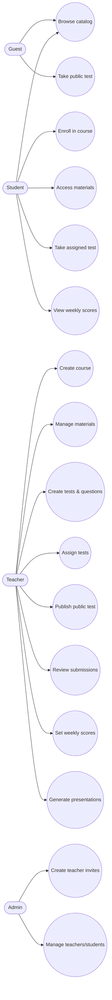
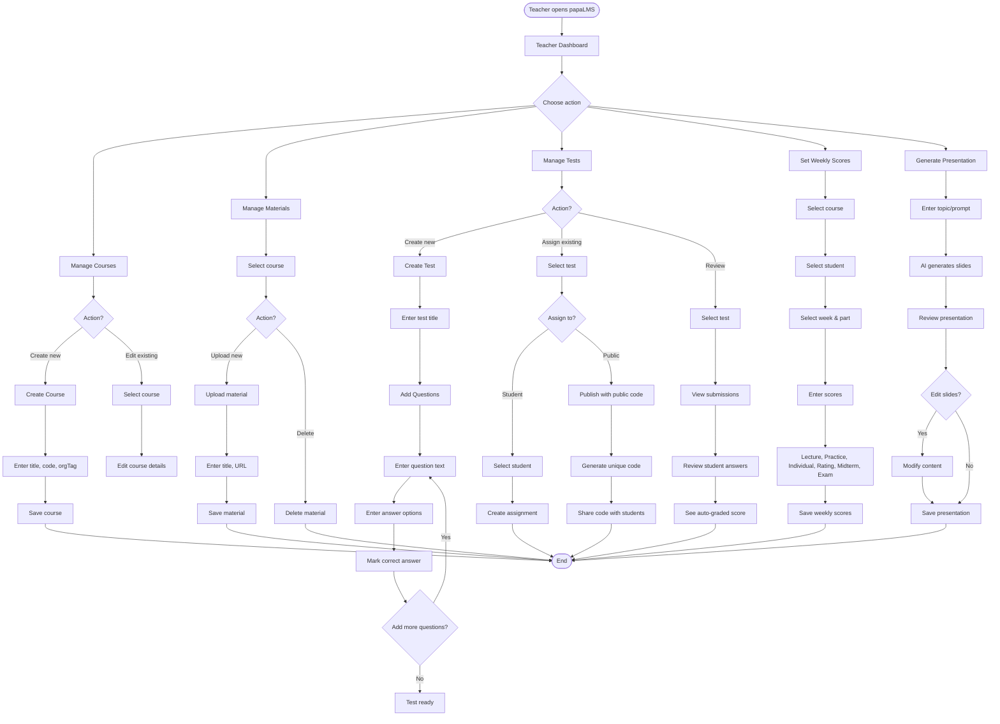
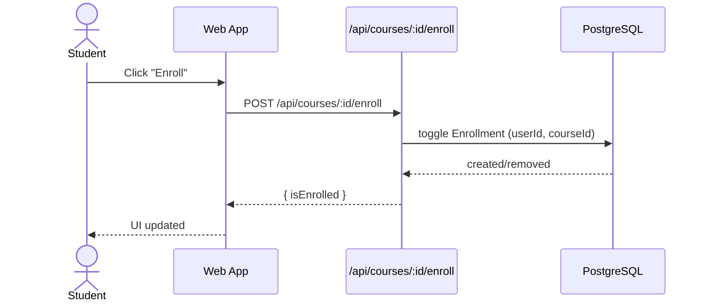
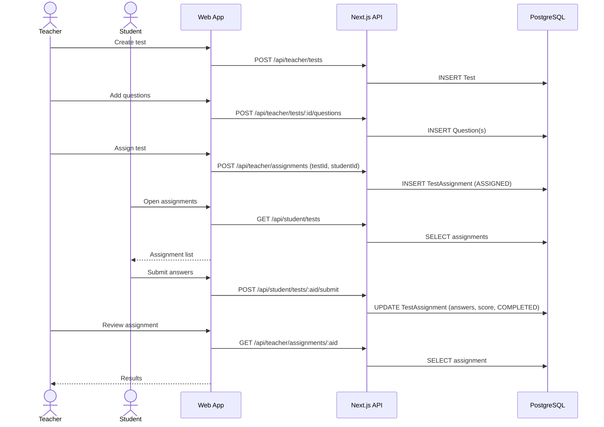
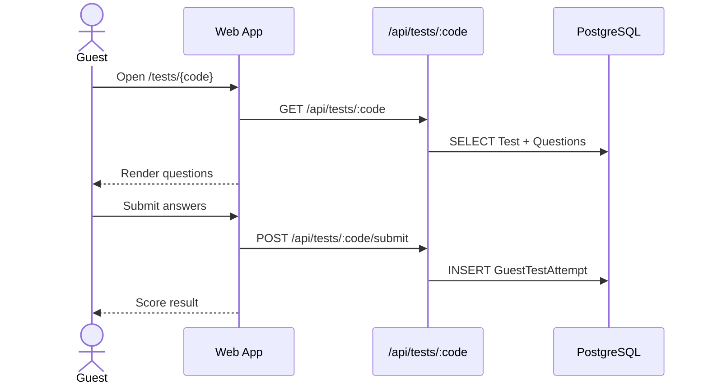

# papaLMS diagrams (Mermaid)

## ER diagram (Prisma -> PostgreSQL)


## Use-case (roles)


## User flow (Teacher)


## Sequence: enroll in course


## Sequence: assign test -> submit -> review


## Sequence: public test (guest)


## Directory structure (high level)
```text
.
├── README.md
├── BACKEND.md
├── package.json
├── next.config.ts
├── tailwind.config.js
├── prisma/
│   ├── schema.prisma
│   ├── migrations/
│   └── seed.cjs
├── prompts/
├── public/
└── src/
    ├── app/
    │   ├── api/
    │   │   ├── admin/
    │   │   ├── auth/
    │   │   ├── courses/
    │   │   ├── student/
    │   │   ├── teacher/
    │   │   ├── tests/
    │   │   └── ...
    │   ├── admin/
    │   ├── catalog/
    │   ├── course/
    │   ├── grades/
    │   ├── login/
    │   ├── presentations/
    │   ├── profile/
    │   ├── student/
    │   ├── teacher/
    │   ├── tests/
    │   └── page.tsx
    ├── components/
    ├── generated/
    ├── lib/
    └── types/
```
